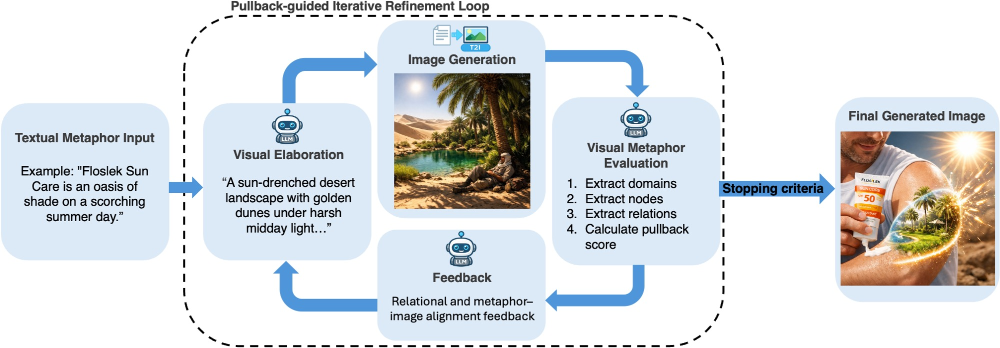

# From Surface Features to Relational Depth: A Category-Theoretic Framework for Measuring and Refining Multimodal Analogies

<p align="center">
  
</p>

### Abstract

Analogical reasoning involves identifying and preserving relational structures across domains. However, existing approaches to AI-driven multimodal analogy generation lack an interpretable measure of whether this structure is understood and maintained in the generated output. We address this gap with Pullback Refinement via Interpretable Structural Mapping (PRISM), a modality-agnostic framework for measuring and improving relational alignment in multimodal analogies, evaluated on visual metaphor generation. PRISM represents analogies as explicit relational mappings grounded in category theory and uses VLMs to instantiate these structures across modalities. Its first component, the pullback score, quantifies relational alignment from the resulting graph representation. On the AnaloBench benchmark, selecting the correct analogy purely by pullback score achieves 82.5% accuracy, demonstrating that the score captures meaningful relational information. PRISM's second component is an iterative refinement loop that uses the pullback score as an in-context feedback signal to iteratively revise the generated image towards greater relational depth. VLM-as-a-judge and human evaluations show that PRISM consistently improves metaphor consistency and analogy appropriateness over zero-shot generation, with human participants preferring the refined output in 57.65% of pairwise comparisons. However, its advantage over a strong CLIPScore-based GEPA prompt optimiser is small, and qualitative analysis reveals that refinement can favour visually crowded compositions rather than genuinely deeper relational correspondences.

The core **pullback score** algorithm and its benchmarking against AnaloBench and SCAR (`scripts/`, `benchmarking/`) were developed collaboratively. Everything under `multimodal_analogy_generation/` applies the framework to visual metaphor generation.

## Installation

Requires Python ≥ 3.11.

```bash
git clone <this-repo-url>
cd multimodal-analogy-framework
pip install -e .
```

`requirements.txt` is also kept in sync for environments that prefer a plain
`pip install -r requirements.txt`.

Create a `.env` file in the repo root with API keys for whichever models you
intend to run:

```
ANTHROPIC_API_KEY=...
OPENAI_API_KEY=...
OPENROUTER_API_KEY=...
AWS_BEARER_TOKEN_BEDROCK=...   # only needed for the Bedrock-hosted calibration models
```

## Repository structure

```text
.
├── src/analogy.py                   # Pydantic schema for a domain graph (nodes/edges)
├── scripts/                         # Shared category-theoretic pullback algorithm
│   ├── ct_pullback.py               #   the domain-agnostic pullback matching algorithm,
│   │                                 #   shared by the AnaloBench, SCAR, and visual-metaphor pipelines
│   ├── generate_analogy_graphs.py   #   SCAR domain-graph generation
│   └── judge_eval.py, judge_graph_eval.py   # LLM-judge validation of extracted graphs
├── benchmarking/
│   ├── analobench/                  # AnaloBench T1 pipeline + ablations (validates the pullback score)
│   ├── scar-baseline/                # SCAR concept-matching benchmark scripts
│   └── prompt/                      # Shared judge prompt template
└── multimodal_analogy_generation/   # Visual metaphor generation
    ├── scripts/                     #   extract.py (4-stage VLM extraction + pullback score),
    │                                 #   generate_images.py (text-to-image wrapper),
    │                                 #   data-analysis.ipynb (human-eval survey analysis)
    ├── zero_shot_exploration/       #   how well current VLMs depict metaphors zero-shot
    ├── iterative_refinement/        #   the feedback loop: generate → score → refine → repeat
    ├── ablations/                   #   one-shot extraction & no-domain-guidance ablations
    ├── baselines/                   #   GEPA baseline (offline prompt optimisation)
    └── evaluation/                  #   VLM-as-a-judge infrastructure + human-eval survey design
```

## Usage

### Pullback score validation (AnaloBench)

Validates the pullback score on an independent analogy-selection benchmark.
Requires the AnaloBench T1 dataset (not redistributed here — see
[Data availability](#data-availability)) at
`benchmarking/analobench/test_analobench.csv`.

```bash
python benchmarking/analobench/analobench_ct.py --condition ct_llm
python benchmarking/analobench/analyse_analobench.py --ct benchmarking/analobench/results/ct_llm.jsonl --zs benchmarking/analobench/results/direct_zeroshot.jsonl --csv benchmarking/analobench/test_analobench.csv --out benchmarking/analobench/results/analysis/
python benchmarking/analobench/visualise_analobench.py --analysis_dir benchmarking/analobench/results/analysis/ --out benchmarking/analobench/results/analysis/figures/
```

Ablations (removing the chain bonus / semantic-role abstraction from the score):

```bash
python benchmarking/analobench/analobench_ct_no_chain_bonus.py --condition ct_llm_no_chain_bonus
python benchmarking/analobench/analobench_ct_no_role_abstraction.py --condition ct_llm_no_role
```

### Domain-graph extraction validation (SCAR)

Validates that LLMs can extract and populate the domain-graph schema.
Requires the SCAR dataset at `benchmarking/scar-baseline/scar_dataset.jsonl`
(not redistributed here — see [Data availability](#data-availability)).

```bash
python scripts/generate_analogy_graphs.py
python scripts/judge_graph_eval.py
python benchmarking/scar-baseline/benchmark-claude.py
python benchmarking/scar-baseline/benchmark-gpt.py
python benchmarking/scar-baseline/benchmark-analysis.py
```

### Visual metaphor generation and refinement

Requires the visual-metaphor dataset (not redistributed here — see
[Data availability](#data-availability)).

```bash
# Zero-shot exploration: how well current VLMs depict metaphors out of the box
python multimodal_analogy_generation/zero_shot_exploration/zero_shot_prompt.py
python multimodal_analogy_generation/scripts/generate_images.py --model gpt-image --condition zero_shot

# Iterative refinement loop (generate -> score -> refine -> repeat)
python multimodal_analogy_generation/iterative_refinement/scripts/refinement_loop.py

# GEPA baseline (offline prompt optimisation instead of per-metaphor refinement)
python multimodal_analogy_generation/baselines/scripts/gepa_baseline.py --metric pullback

# VLM-as-a-judge evaluation
python multimodal_analogy_generation/evaluation/scripts/judge_batch.py --scores multimodal_analogy_generation/iterative_refinement/scores.csv --select last --out multimodal_analogy_generation/evaluation/results/last_judge_scores.csv
```

Each script's module docstring documents its own inputs, outputs, and full
CLI options — see the individual files under `scripts/`.

## Data availability

- **Visual metaphor dataset** (250 textual metaphors, human-created reference
  images, and annotated gold-standard source/target domains): will be
  released as a separate public dataset. Link to be added upon release.
- **AnaloBench** (Ye et al., 2024) and **SCAR** (Yuan et al., 2023) are
  third-party benchmarks and are not redistributed in this repository.
  Obtain them from their original sources and place them at the paths shown
  in [Usage](#usage) above to reproduce the benchmark-validation results.
- **Human evaluation responses** are not included in this repository to
  protect participant privacy, per the study's consent agreement. The
  survey design/assignment artefacts (which anonymous group saw which image
  pairs) are included under `multimodal_analogy_generation/evaluation/results/`,
  and the analysis code (Wilcoxon tests, Cohen's κ, Krippendorff's α) is in
  `multimodal_analogy_generation/scripts/data-analysis.ipynb`.

## License

This project is licensed under the Apache License 2.0 — see the [LICENSE](LICENSE) file for details.
